# 🐾 Stray Pet

<p align="center">
  <strong>A comprehensive pet adoption and rescue platform for HarmonyOS</strong>
</p>

<p align="center">
  <a href="#features">Features</a> •
  <a href="#screenshots">Screenshots</a> •
  <a href="#tech-stack">Tech Stack</a> •
  <a href="#installation">Installation</a> •
  <a href="#api-documentation">API</a> •
  <a href="#license">License</a>
</p>

---

## 📖 Overview

**Stray Pet** is a full-featured mobile application designed to connect stray animals with loving homes. Built with HarmonyOS ArkTS for the frontend and Django REST Framework for the backend, this platform facilitates pet adoption, lost pet reporting, shelter management, and community engagement.

The app provides a seamless experience for users to browse adoptable pets, report lost animals, connect with shelters, read educational blog content, and communicate with other pet lovers.

---

## ✨ Features

### 🏠 Home
The home screen provides quick access to all major features with a clean, intuitive interface.

<p align="center">
  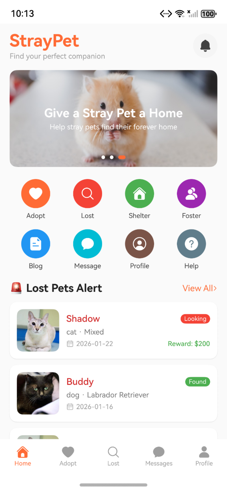
  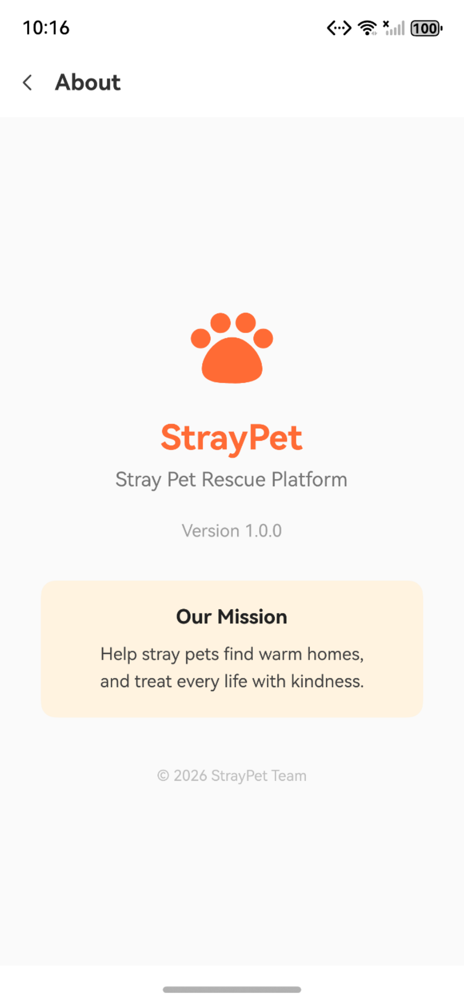
</p>

- **Quick Navigation** - Easy access to Adoption, Lost Pets, Shelters, Blog, and Holiday Family
- **Featured Pets** - Discover pets looking for homes
- **Latest Updates** - Stay informed about recent lost pet reports
- **Notification Badge** - See unread notifications at a glance

---

### 🐕 Pet Adoption

Browse and adopt pets from local shelters with detailed information about each animal.

<p align="center">
  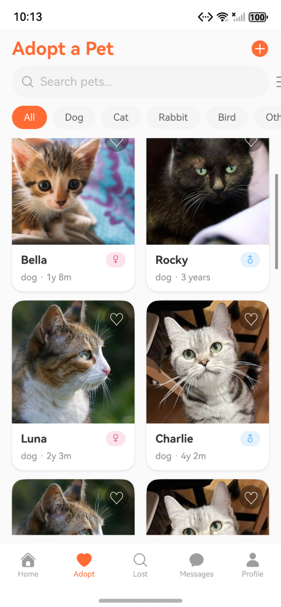
  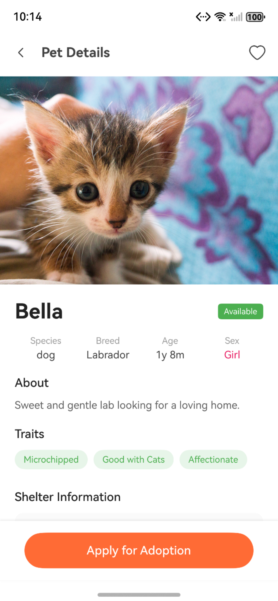
  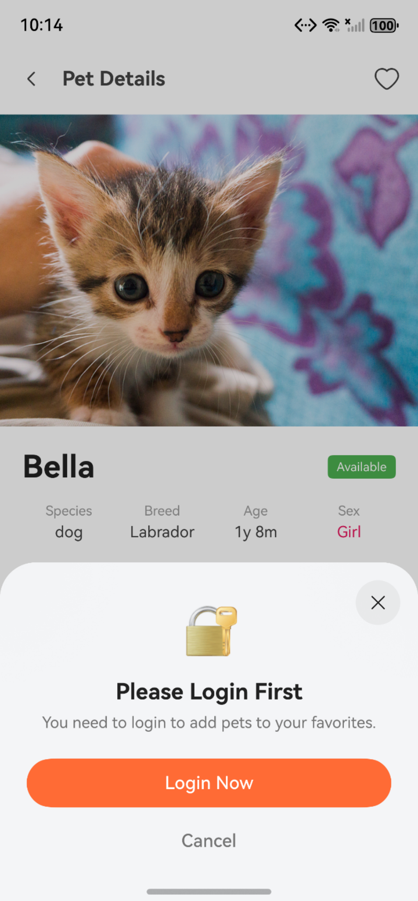
</p>

**Features:**
- **Pet Listings** - Browse available pets with photos, names, breeds, and ages
- **Advanced Filtering** - Filter by species, breed, size, gender, and traits
- **Detailed Profiles** - View health status, personality traits, and shelter information
- **Favorites** - Save pets you're interested in
- **Adoption Application** - Apply directly through the app
- **Shelter Information** - See which shelter is caring for each pet

---

### 🔍 Lost & Found Pets

Help reunite lost pets with their families or report found strays.

<p align="center">
  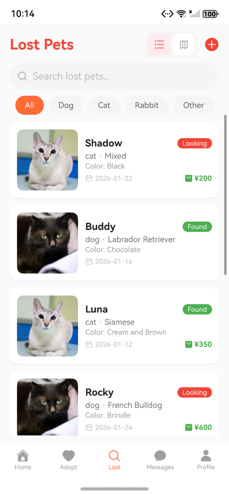
  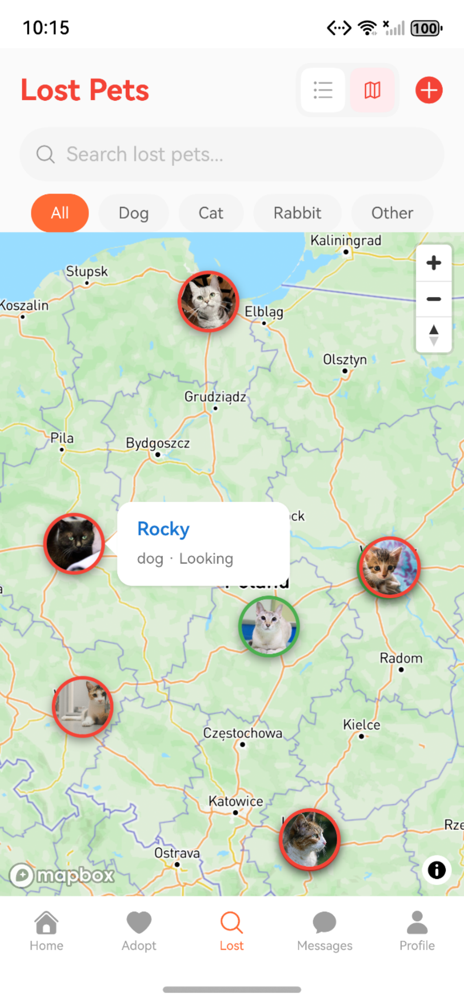
  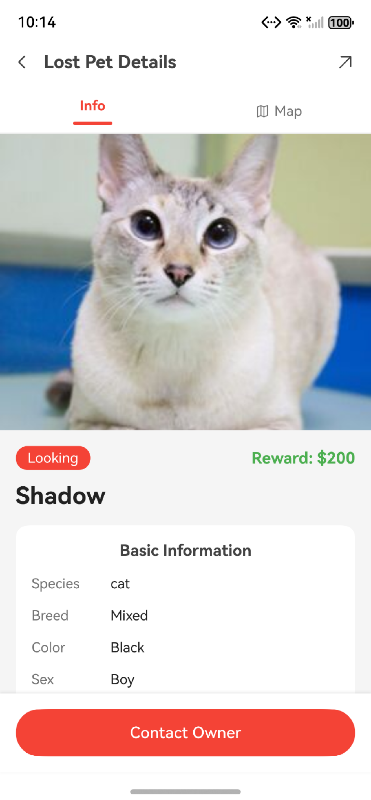
  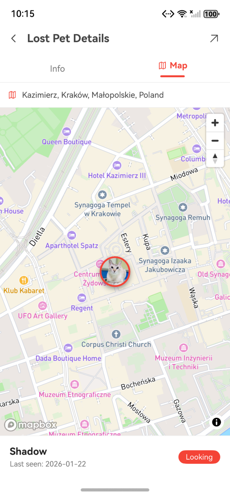
</p>

**Features:**
- **Map View** - See lost pet locations on an interactive map
- **List View** - Browse lost pet reports chronologically
- **Report Lost Pet** - Submit detailed information with photos and last known location
- **Search** - Find specific lost pets by species, color, or area
- **Contact Owner** - Reach out directly if you've found a pet

---

### 🏥 Shelters

Discover animal shelters in your area and learn about their work.

<p align="center">
  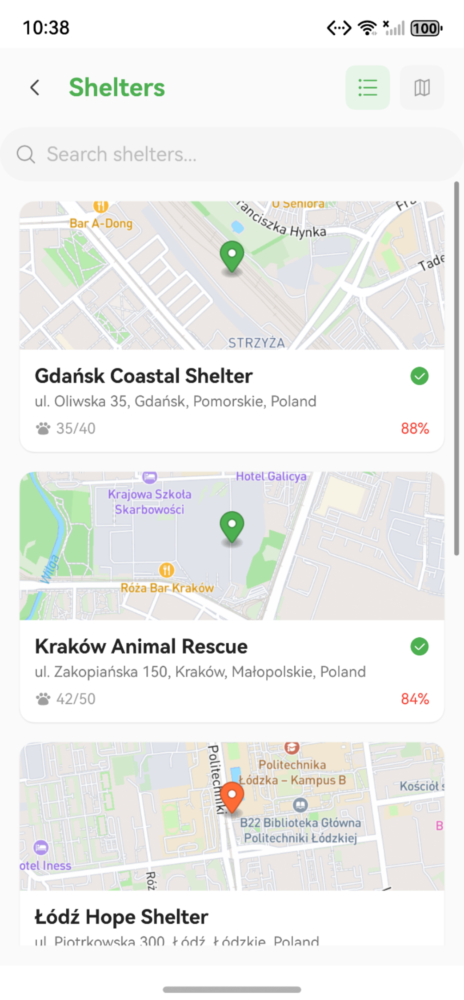
  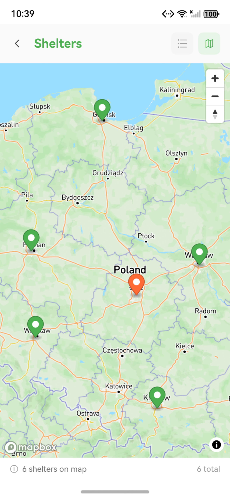
</p>

**Features:**
- **Shelter Directory** - Find verified shelters near you
- **Capacity Info** - See current animal counts and availability
- **Contact Details** - Phone, email, website, and social media links
- **Location Map** - Get directions to shelters
- **Pet Listings** - View all pets at a specific shelter

---

### 📝 Blog

Educational content about pet care, adoption stories, and animal welfare.

<p align="center">
  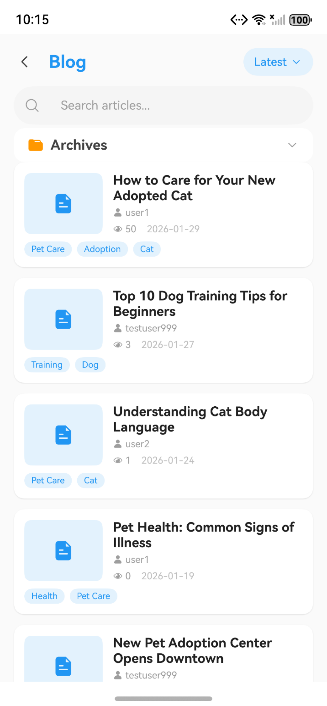
  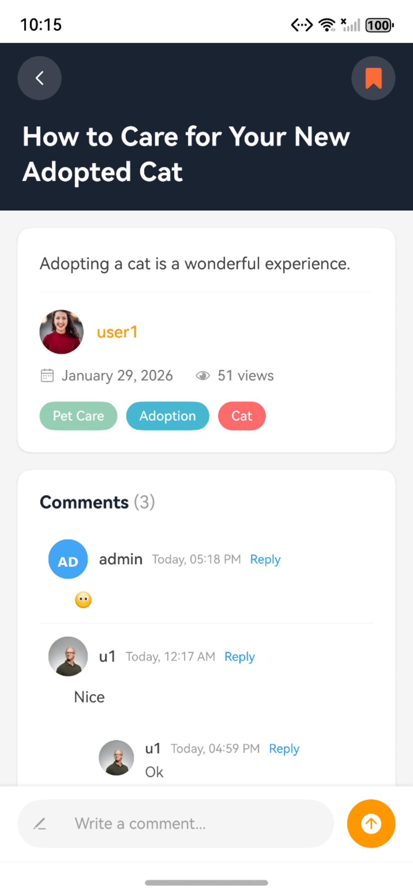
</p>

**Features:**
- **Article Feed** - Browse articles with thumbnails and summaries
- **Categories & Tags** - Filter content by topics
- **Full Articles** - Rich text content with images
- **Comments** - Engage with the community
- **Favorites** - Save articles for later reading
- **Create Posts** - Share your own stories and tips

---

### 🏡 Holiday Family Program

Temporary foster care program for shelter animals during holidays.

<p align="center">
  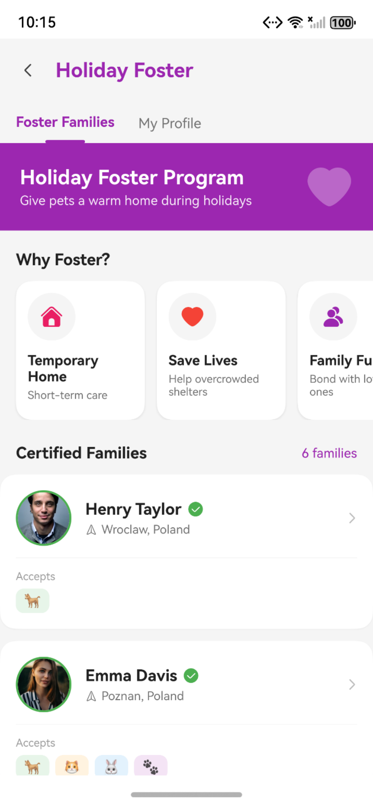
</p>

**Features:**
- **Program Information** - Learn about temporary fostering
- **Apply to Foster** - Submit your application with home details
- **Verified Families** - Browse certified foster families
- **Pet Preferences** - Specify what types of pets you can accommodate

---

### 💬 Messages & Social

Connect with other users and shelters through private messaging.

<p align="center">
  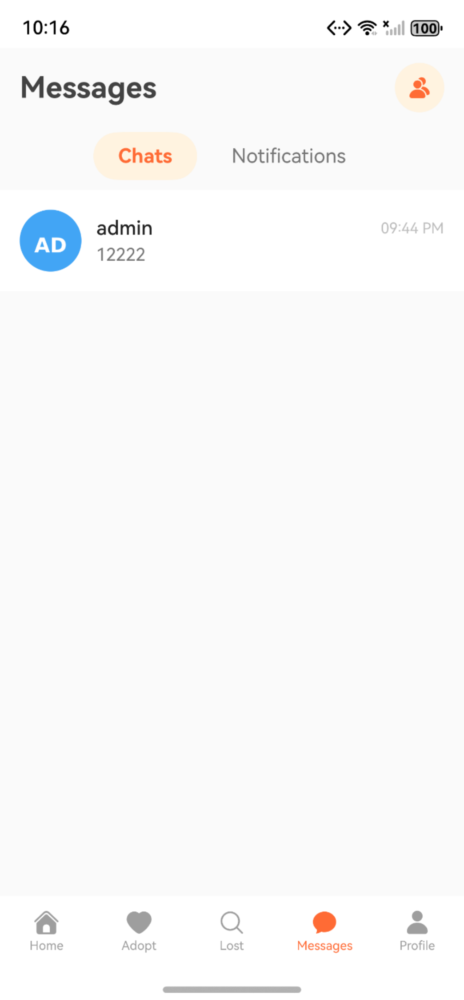
  
  
</p>

**Features:**
- **Conversations** - Chat with other users and shelters
- **Real-time Updates** - Messages refresh automatically
- **Friend System** - Add friends and manage connections
- **Friend Requests** - Accept or decline connection requests
- **Notifications** - Get notified of new messages and activities

---

### 🔔 Notifications

Stay updated on all activities related to your account.

<p align="center">
  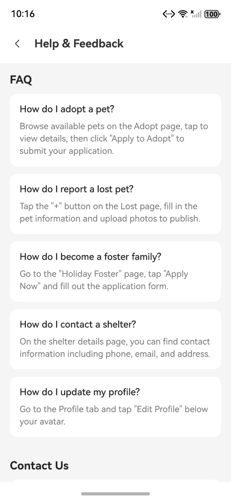
</p>

**Features:**
- **Activity Feed** - See all notifications in one place
- **Types** - Comments, likes, friend requests, system alerts
- **Mark as Read** - Manage notification status
- **Quick Actions** - Respond to friend requests directly

---

### 👤 User Profile

Manage your account and personal information.

<p align="center">
  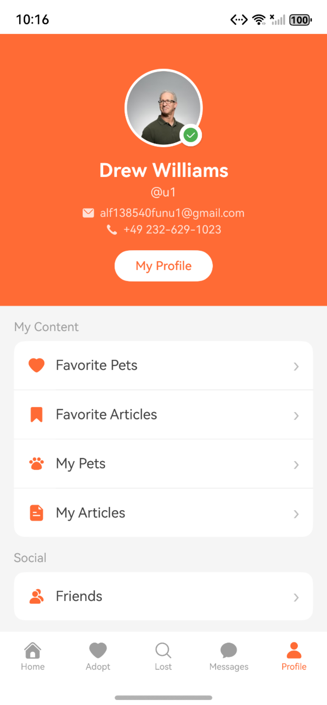
  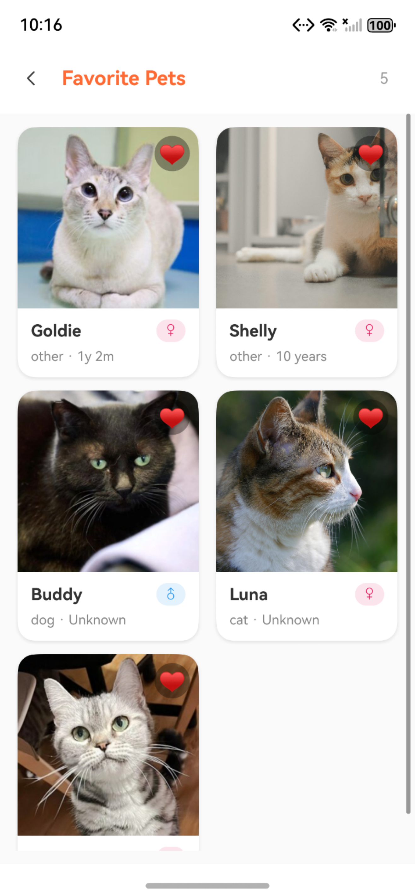
  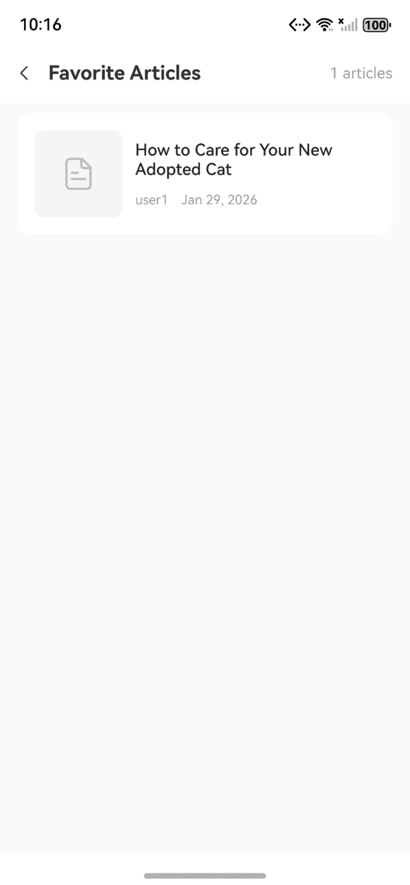
</p>

**Features:**
- **Profile Management** - Update avatar, name, and contact info
- **My Favorites** - Quick access to saved pets and articles
- **My Posts** - Manage your published content
- **Friends List** - View and manage connections
- **Settings** - App preferences and account options

---

### 🔐 Authentication

Secure user authentication with multiple options.

<p align="center">
  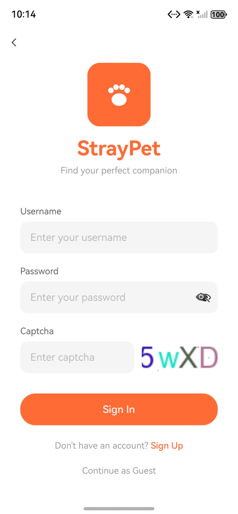
  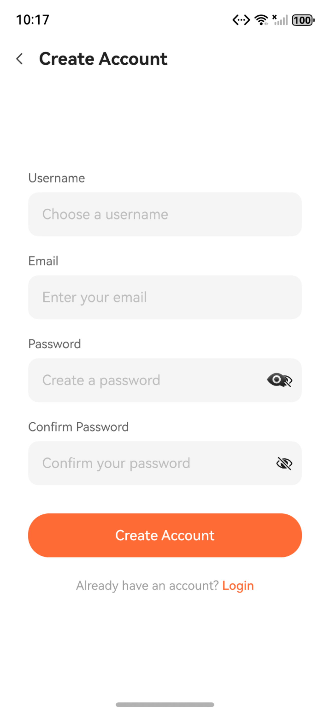
</p>

**Features:**
- **Login** - Username/email and password
- **Registration** - Create account with email verification
- **Password Reset** - Recover access via email
- **JWT Tokens** - Secure authentication with auto-refresh
- **Remember Me** - Persistent login across sessions

---

## 🛠 Tech Stack

### Frontend (Mobile)
| Technology | Purpose |
|------------|---------|
| **HarmonyOS** | Target platform |
| **ArkTS** | UI development language |
| **ArkUI** | Declarative UI framework |
| **@ohos/http** | Network requests |

### Backend
| Technology | Purpose |
|------------|---------|
| **Django 4.x** | Web framework |
| **Django REST Framework** | API development |
| **PostgreSQL + PostGIS** | Database with geospatial support |
| **SimpleJWT** | Token authentication |
| **Docker** | Containerization |

### Architecture
```
┌─────────────────────────────────────────────────────────────┐
│                    HarmonyOS Mobile App                      │
│  ┌─────────┐  ┌─────────┐  ┌─────────┐  ┌─────────┐        │
│  │  Pages  │  │Services │  │ Models  │  │Components│        │
│  └────┬────┘  └────┬────┘  └────┬────┘  └────┬────┘        │
│       └───────────┬┴───────────┬┴────────────┘              │
│                   │            │                             │
└───────────────────┼────────────┼─────────────────────────────┘
                    │  HTTP/JWT  │
┌───────────────────┼────────────┼─────────────────────────────┐
│                   ▼            ▼                             │
│              Django REST Framework API                       │
│  ┌─────────┐  ┌─────────┐  ┌─────────┐  ┌─────────┐        │
│  │  Views  │  │Serializ.│  │ Models  │  │  Auth   │        │
│  └────┬────┘  └────┬────┘  └────┬────┘  └────┬────┘        │
│       └───────────┬┴───────────┬┴────────────┘              │
│                   │            │                             │
│              PostgreSQL + PostGIS                            │
└─────────────────────────────────────────────────────────────┘
```

---

## 📦 Installation

### Prerequisites
- DevEco Studio 5.0 or later
- HarmonyOS SDK
- Python 3.10+
- Docker & Docker Compose
- PostgreSQL with PostGIS extension

### Frontend Setup

1. **Clone the repository**
   ```bash
   git clone https://github.com/yourusername/StrayPet.git
   cd StrayPet
   ```

2. **Open in DevEco Studio**
   - Open DevEco Studio
   - File → Open → Select the project folder
   - Wait for sync to complete

3. **Configure API endpoint**
   - Edit `mobile/src/main/ets/services/ApiConfig.ets`
   - Update `BASE_URL` to your backend server address

4. **Build and run**
   - Connect your HarmonyOS device or start an emulator
   - Click Run → Run 'mobile'

### Backend Setup

1. **Navigate to backend directory**
   ```bash
   cd backend
   ```

2. **Start with Docker Compose**
   ```bash
   docker-compose up -d
   ```

3. **Run migrations**
   ```bash
   docker exec sp_web python manage.py migrate
   ```

4. **Create superuser**
   ```bash
   docker exec -it sp_web python manage.py createsuperuser
   ```

5. **Access the API**
   - API: `http://localhost:8000/`
   - Admin: `http://localhost:8000/admin/`
   - API Docs: `http://localhost:8000/swagger/`

---

## 📚 API Documentation

### Main Endpoints

| Endpoint | Description |
|----------|-------------|
| `POST /auth/login/` | User login |
| `POST /auth/register/` | User registration |
| `GET /pets/` | List adoptable pets |
| `GET /pets/{id}/` | Pet details |
| `POST /pets/{id}/apply/` | Apply for adoption |
| `GET /lost/` | List lost pets |
| `POST /lost/` | Report lost pet |
| `GET /shelters/` | List shelters |
| `GET /blog/` | List articles |
| `GET /user/notifications/` | User notifications |
| `GET /user/messages/` | Private messages |
| `GET /user/friendships/` | Friend list |

### Authentication
All authenticated endpoints require a JWT token in the header:
```
Authorization: Bearer <access_token>
```

---

## 📁 Project Structure

```
StrayPet/
├── mobile/                    # HarmonyOS mobile app
│   └── src/main/
│       ├── ets/
│       │   ├── components/    # Reusable UI components
│       │   ├── models/        # Data models
│       │   ├── pages/         # Screen pages
│       │   └── services/      # API services
│       └── resources/         # Assets and configs
├── backend/                   # Django backend
│   ├── api/                   # API configuration
│   ├── apps/
│   │   ├── pet/              # Pet, Shelter, Adoption
│   │   ├── blog/             # Articles, Comments
│   │   ├── user/             # Users, Messages, Notifications
│   │   └── holiday_family/   # Foster program
│   ├── common/               # Shared utilities
│   └── server/               # Django settings
├── images/                    # Documentation images
└── README.md
```

---

## 🤝 Contributing

Contributions are welcome! Please feel free to submit a Pull Request.

1. Fork the repository
2. Create your feature branch (`git checkout -b feature/AmazingFeature`)
3. Commit your changes (`git commit -m 'Add some AmazingFeature'`)
4. Push to the branch (`git push origin feature/AmazingFeature`)
5. Open a Pull Request

---

## 📄 License

This project is licensed under the Apache License 2.0 - see the [LICENSE](LICENSE) file for details.

---

## 🙏 Acknowledgments

- All the shelters working tirelessly to help stray animals
- The open-source community for amazing tools and libraries
- Pet lovers everywhere who make adoption possible

---

<p align="center">
  Made with ❤️ for stray pets everywhere
</p>
